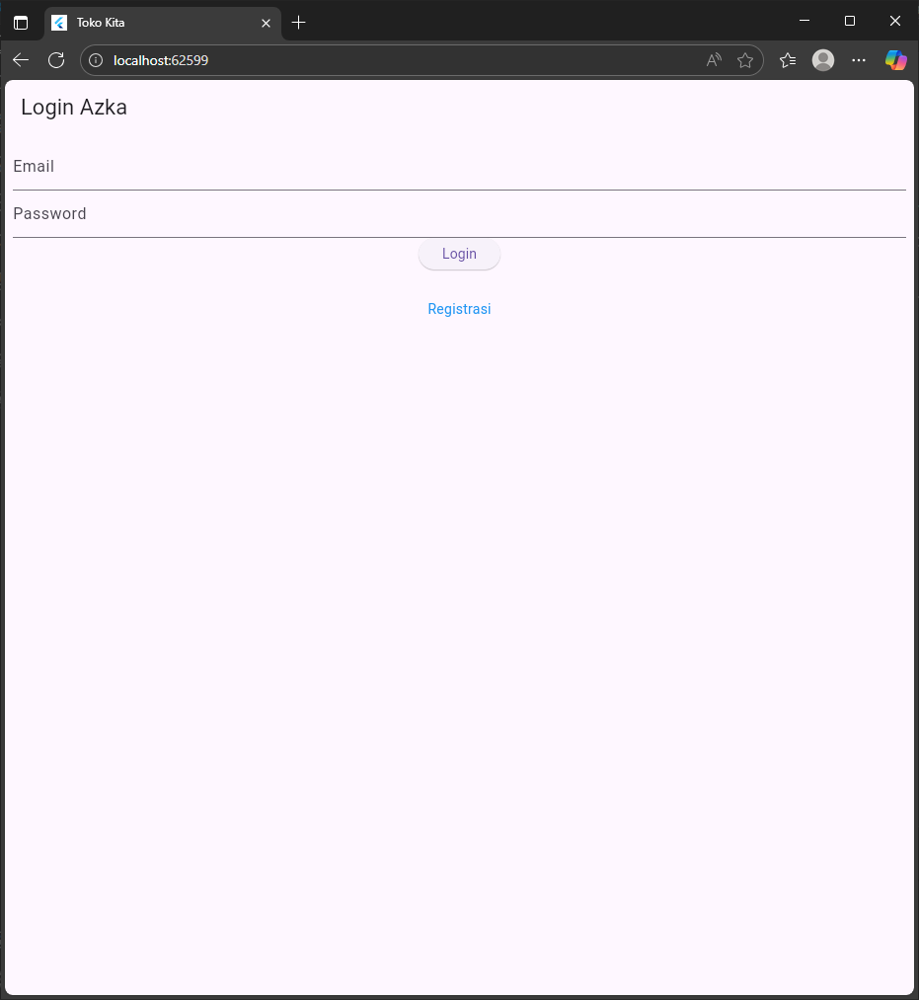
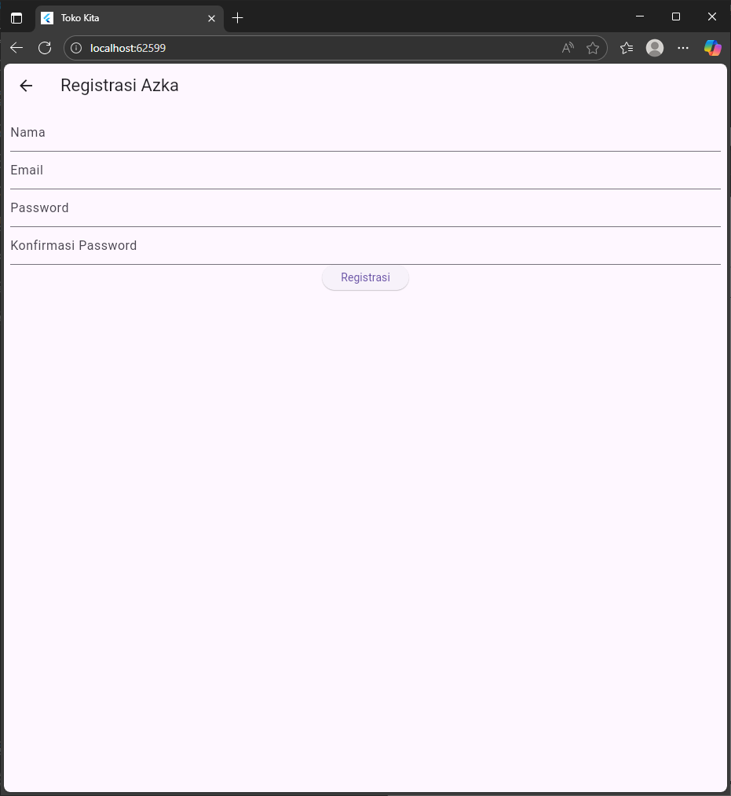
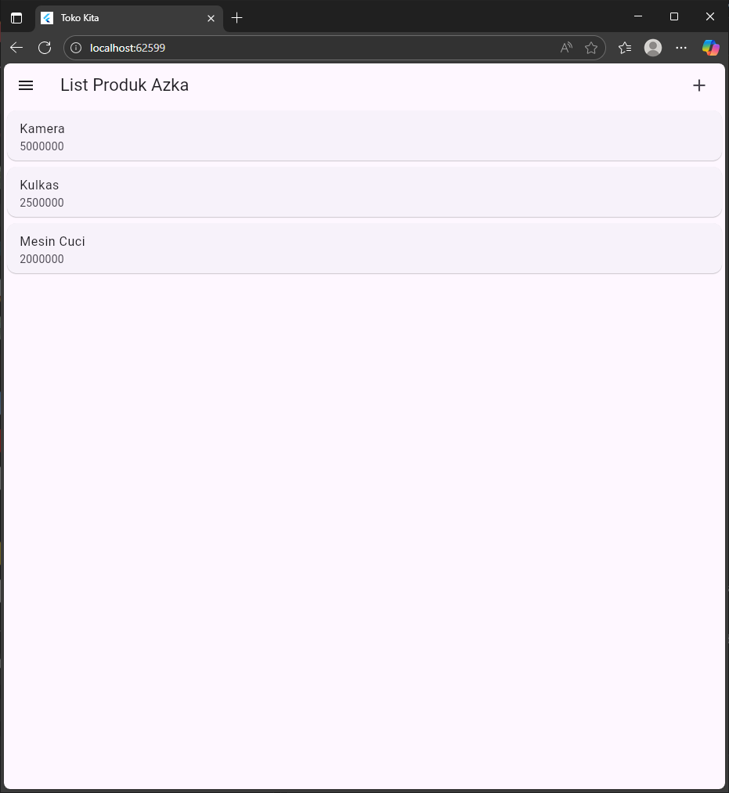
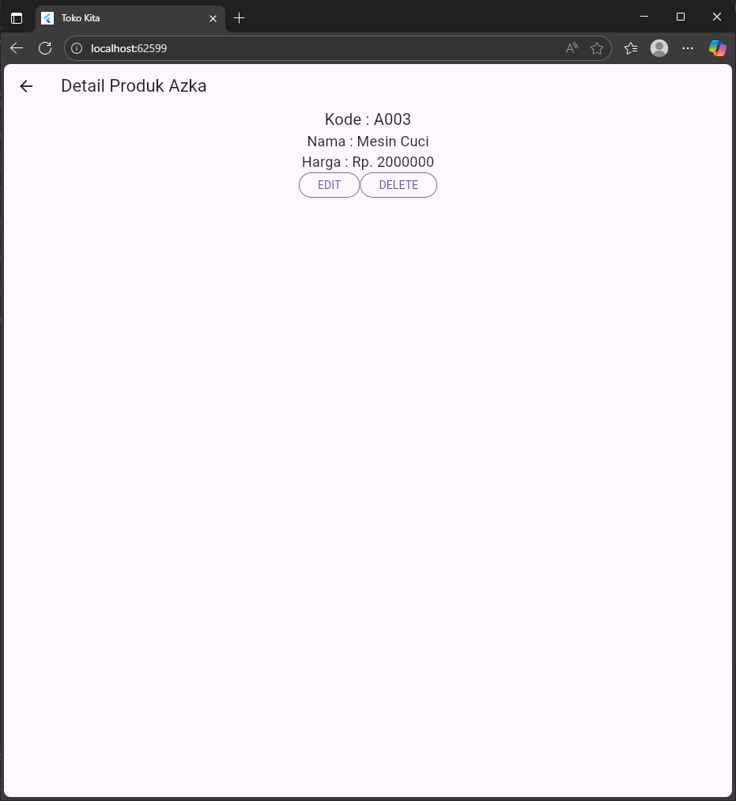
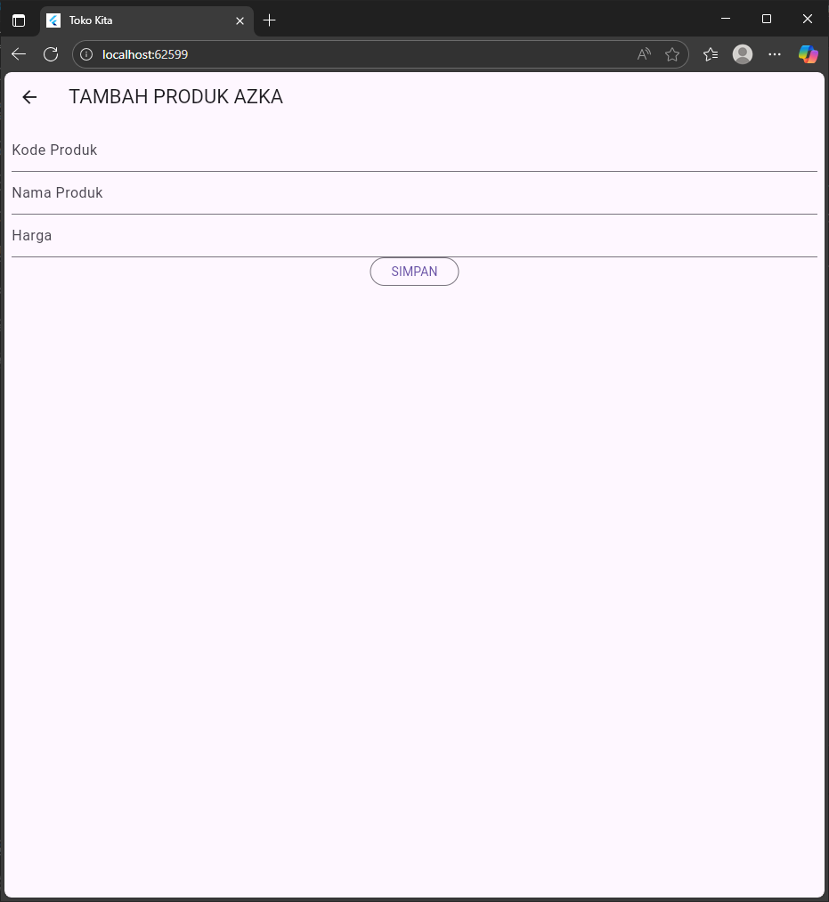
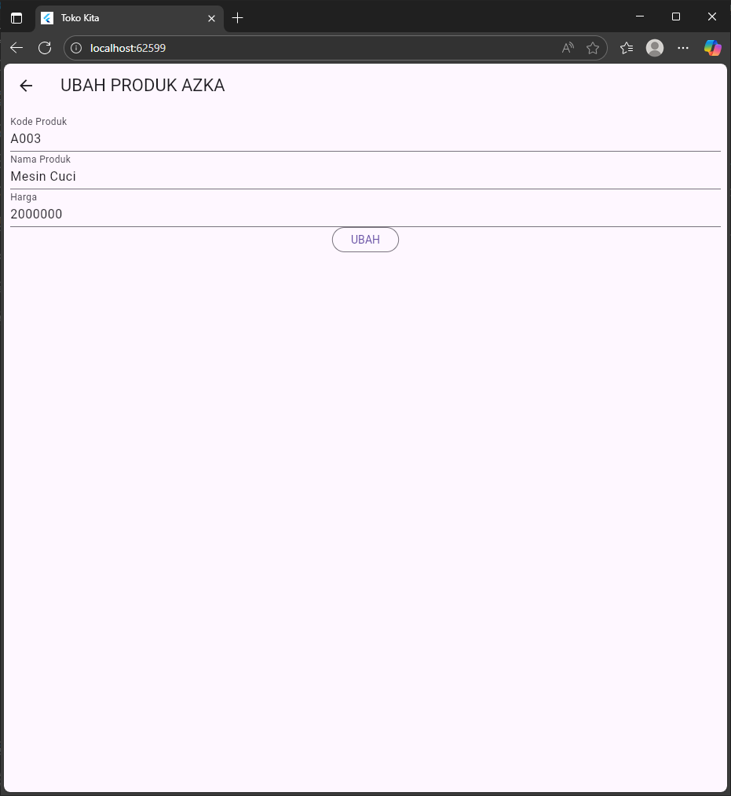

# H1D023066

## Halaman Aplikasi

### 1. Halaman Login


**File:** `lib/ui/login_page.dart`

**Penjelasan:**
- Form login dengan validasi email dan password
- TextFormField untuk input email dengan keyboard type email
- TextFormField untuk password dengan obscureText=true
- Tombol navigasi ke halaman registrasi
- Validasi form menggunakan GlobalKey<FormState>

**Komponen Utama:**
```dart
- _emailTextboxController: Controller untuk input email
- _passwordTextboxController: Controller untuk input password
- _formKey: Key untuk validasi form
- _buttonLogin(): Tombol untuk submit login
- _menuRegistrasi(): Link navigasi ke halaman registrasi
```

---

### 2. Halaman Registrasi


**File:** `lib/ui/registrasi_page.dart`

**Penjelasan:**
- Form registrasi dengan 4 input field
- Validasi nama (minimal 3 karakter)
- Validasi email menggunakan regex pattern
- Validasi password (minimal 6 karakter)
- Validasi konfirmasi password harus sama dengan password
- AppBar dengan tombol back otomatis

**Komponen Utama:**
```dart
- _namaTextboxController: Controller untuk input nama
- _emailTextboxController: Controller untuk input email
- _passwordTextboxController: Controller untuk input password
- Pattern regex untuk validasi format email
- Validator untuk setiap field dengan pesan error yang sesuai
```

---

### 3. Halaman Daftar Produk


**File:** `lib/ui/produk_page.dart`

**Penjelasan:**
- AppBar dengan tombol tambah produk (icon +)
- Drawer dengan menu logout
- ListView menampilkan daftar produk dalam Card
- Setiap item produk menampilkan nama dan harga
- GestureDetector untuk navigasi ke halaman detail
- Data produk dummy (Kamera, Kulkas, Mesin Cuci)

**Komponen Utama:**
```dart
- ItemProduk: Widget stateless untuk menampilkan item produk
- Card dengan ListTile untuk layout produk
- Navigator.push untuk navigasi ke ProdukDetail dan ProdukForm
- Drawer dengan ListTile untuk menu logout
```

---

### 4. Halaman Detail Produk


**File:** `lib/ui/produk_detail.dart`

**Penjelasan:**
- Menampilkan detail lengkap produk (kode, nama, harga)
- Tombol EDIT untuk navigasi ke form edit produk
- Tombol DELETE untuk menghapus produk
- AlertDialog konfirmasi sebelum hapus
- Text widget dengan style fontSize berbeda untuk setiap field

**Komponen Utama:**
```dart
- widget.produk: Parameter produk yang diterima dari halaman sebelumnya
- _tombolHapusEdit(): Row dengan 2 OutlinedButton
- confirmHapus(): Method untuk menampilkan dialog konfirmasi
- AlertDialog dengan tombol Ya dan Batal
```

---

### 5. Halaman Form Produk (Tambah/Edit)



**File:** `lib/ui/produk_form.dart`

**Penjelasan:**
- Form dinamis untuk tambah atau edit produk
- Judul dan tombol berubah sesuai mode (TAMBAH/UBAH)
- 3 TextFormField dengan validasi (kode, nama, harga)
- initState() untuk mengisi data saat mode edit
- Keyboard type number untuk input harga

**Komponen Utama:**
```dart
- isUpdate(): Method untuk cek mode dan set data awal
- _kodeProdukTextboxController: Input kode produk
- _namaProdukTextboxController: Input nama produk
- _hargaProdukTextboxController: Input harga (keyboardType: number)
- Validasi isEmpty untuk semua field
```

---

## Model Data

### Login Model
**File:** `lib/model/login.dart`

```dart
- code: Status code response
- status: Boolean status
- token: Token autentikasi
- userID: ID user
- userEmail: Email user
- fromJson: Factory constructor untuk parsing JSON
```

### Registrasi Model
**File:** `lib/model/registrasi.dart`

```dart
- code: Status code response
- status: Boolean status
- data: Data response string
- fromJson: Factory constructor untuk parsing JSON
```

### Produk Model
**File:** `lib/model/produk.dart`

```dart
- id: ID produk (String)
- kodeProduk: Kode unik produk
- namaProduk: Nama produk
- hargaProduk: Harga produk (int)
- fromJson: Factory constructor untuk mapping dari JSON API
```